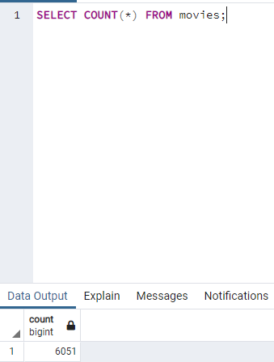
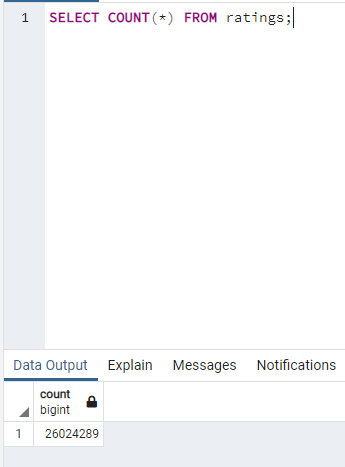

# Movies ETL
## Purpose

## Deliverable 1: Write an ETL Function to Read Three Data Files
Code: 
## Deliverable 2: Extract and Transform the Wikipedia Data
Code: 
## Deliverable 3: Extract and Transform the Kaggle Data
Code: 
## Create the Movie Database
Code: 
## Resources
Data: \
Data: \
### Queries and results
\

